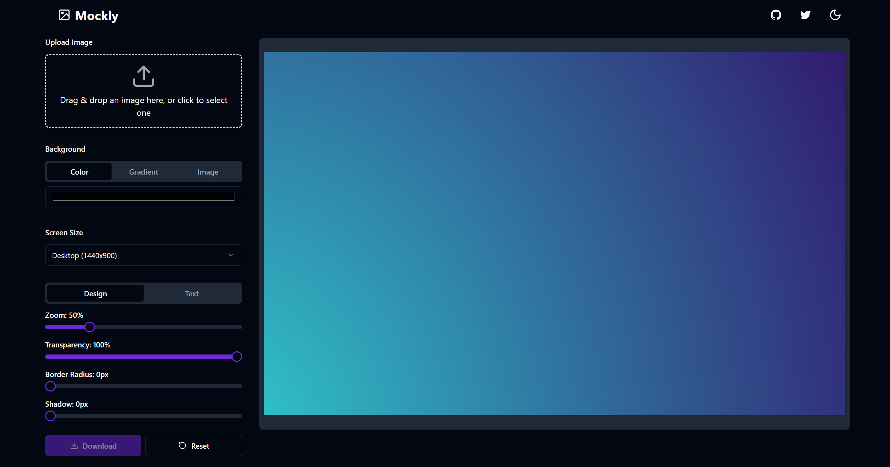

# Mockly 🎨
[](https://www.mockly.site)
[](https://nextjs.org/)
[](https://reactjs.org/)
[](https://www.typescriptlang.org/)
[](https://tailwindcss.com/)
[](https://ui.shadcn.com/)
[](https://opensource.org/licenses/MIT)


**Create Stunning Screenshots in Seconds**



Mockly is an open-source tool that allows developers to create professional-looking screenshots and mockups with ease. With Mockly, you can pick, place, and zoom—done. It's designed for fast, stress-free mockups for developers who'd rather code than design.


## ✨ Features

- **Instant Mockups**: Upload, tweak, done. It's like magic, but without the wand.
- **Multi-device Preview**: Instantly see how your designs look on any screen size—because nobody has time for resizing.
- **Zoom & Place**: Put your screenshots exactly where you want, and zoom in like a pro—minus the struggle.
- **Text & Style**: Add text, pick your font, and make it pop. Because plain screenshots are so last year.
- **No Login Required**: Start creating immediately without any sign-up process.
- **No Watermarks**: Your designs, your brand—no unwanted additions.
- **Free to Use**: Powerful features accessible to everyone at no cost.

## 🚀 Getting Started

### Prerequisites

- Node.js (v14 or later)
- npm or yarn

### Installation

1. Clone the repository:
   ```
   git clone https://github.com/suryanshsingh2001/mockly.git
   ```

2. Navigate to the project directory:
   ```
   cd mockly
   ```

3. Install dependencies:
   ```
   npm install
   # or
   yarn install
   ```

4. Start the development server:
   ```
   npm run dev
   # or
   yarn dev
   ```

5. Open [http://localhost:3000](http://localhost:3000) in your browser to see the application.

## 🖱️ Usage

1. Navigate to the editor page.
2. Upload your screenshot or choose from available templates.
3. Use the intuitive interface to adjust, zoom, and place your image.
4. Add text, choose fonts, and style as needed.
5. Preview your design on multiple device sizes.
6. Download your finished mockup.

## 🔮 Future Scope

We have exciting plans for the future of Mockly, and we welcome contributions in these areas:

1. **Video Editor**: We're planning to expand Mockly's capabilities to include a video editor that follows the same philosophy as our image editor—quick, intuitive, and designed for developers who want to create professional-looking video content without the complexity of traditional video editing software.

2. **AI-Assisted Design**: Implementing AI to suggest design improvements and automate repetitive tasks.

3. **Template Marketplace**: A platform for users to share and download custom templates.

4. **Collaboration Features**: Real-time collaboration tools for team projects.

5. **Plugin System**: Allowing developers to extend Mockly's functionality with custom plugins.

We encourage contributors to think creatively about these future directions and propose innovative solutions to help bring these ideas to life.

## Blog Post 

# Because Mockly is a mandatory requirement for front-end developers.

As a front-end developer It is your responsibility to create a user interface that is not only functional but also functional. But it also catches the eye. In this highly competitive situation Having the right ferramenta can make all the difference. Digite **Mockly** — An open source ferrament designed to help developers easily create professional-looking canvases and models. In this blog post We'll take a look at why Mockly is such an important asset for every front-end developer.

## Introduction

Its parody has everything to do with simplicity and efficiency. It allows developers to create impressive models quickly. It keeps you focused on what you do best. That is writing code. With his easy-to-use resources, Mockly transforms the simulation process into a rich, seamless experience that he enjoys reducing design headaches.

## 1. **Instant simulation**

One of Mockly's two standout resources is its ability to create mockups on the fly. Just upload your picture. Adjust the image as you want and soon! This fast turnaround means you can manage high-quality simulations without having to worry about complicated design software.

### example:
Imagine you're looking for a mockup to demo a new resource. With Mockly, you can upload a canvas image. Adjust elements and prepare complex mockups for presentations in just minutes.

## 2. **Viewing multiple devices**

In today's world where there are many different devices. It's important to see how your design will look across multiple fabric sizes. Mockly allows you to instantly visualize your model on multiple devices. So you can guarantee that your design is responsive and easy to use. without having to adjust the size or feel uncomfortable

### Main benefits:
Chega of guessing games: Get instant feedback on how your design will appear on phones, tablets, and desktops.

## 3. **Zoom and positioning functions**
Mockly's zoom and positioning features help you position your fabric grips exactly where you want them. This precision eliminates the hassle typically associated with adding elements to a model. This facilitates achieving the perfect layout.

### Use cases:
Is it accurate in focusing attention on specific elements of the UI? Zoom in or position correctly your simulation - easily and with little to no results.


## 4. **Further customize text and style.**
Gone are the days of simple, uninspiring fabric drawings. With Mockly, you can add text. Choose a font and format your model to highlight it. This customization not only improves visual appeal. But it also helps ensure that the model is consistent with the brand identity.

### example:
Enhance your mockup with an eye-catching title or annotation that clearly communicates your design intent. Change a simple picture Make it an effective presentation

## 5. **No login required.**
One of the most frustrating obstacles in using a new furniture is the registration process. Kidding removes this obstacle. This allows you to start breeding immediately without needing to log in. This means you can integrate it directly into your project without the distraction of creating an account.

## 6. **Clerk's Watermark**
When having to present your work The last thing you want is an unwanted watermark cluttering up your design. Mockly guarantees that his creations are all his own. There are no watermarks, just professional quality mockups that truly reflect his brand.

## 7. **Free to use**
By fim Using Mockly is completely free. and accessible to everyone It brings together powerful resources at no cost. It enables developers of all backgrounds to accelerate their workflow without financial barriers.

#### Conclusion
In summary, Mockly is a must-have for any front-end developer who wants to improve their design process. Snapshot layout resources Multi-device display Zoom and positioning resources Customizable message And its ease of use makes it an invaluable resource. Whether you're creating a mockup for a customer presentation or an internal project, Mockly makes the process easier. So you can focus on writing code and delivering a great user experience.

If you haven't tried Mockly yet, now's the time to try it. Vary your simulation process and see how it can benefit your development pipeline!


## 🎉 Hacktoberfest 2024

We're excited to participate in Hacktoberfest 2024! Here's how you can contribute:

### 📜 Ground Rules

1. Contributions must be meaningful and add value to the project.
2. Follow our code style and best practices.
3. Be respectful and collaborative in discussions.
4. Test your changes thoroughly before submitting a PR.

### 🛠️ How to Contribute

1. Fork the repository to your GitHub account.
2. Create a new branch for your feature or bug fix:
   ```
   git checkout -b feature/your-feature-name
   ```
   or
   ```
   git checkout -b fix/your-bug-fix-name
   ```
3. Make your changes, ensuring they align with the issue template if addressing a specific issue.
4. Commit your changes with a clear and descriptive commit message.
5. Push your branch to your forked repository:
   ```
   git push origin feature/your-feature-name
   ```
6. Open a Pull Request (PR) to our `main` branch.

### 🔄 Pull Request Process

1. Ensure your PR description clearly describes the problem and solution. Include the relevant issue number if applicable.
2. Include screenshots or GIFs in your PR if you've made UI changes.
3. Make sure your code is properly formatted and passes all tests.
4. Your PR will be reviewed by maintainers. Be open to feedback and make necessary changes.
5. Once approved, your PR will be merged into the main codebase.

### 📝 Issue Templates

When creating a new issue or PR, please use our provided templates:

- For bug reports: [Bug Report Template](.github/ISSUE_TEMPLATE/bug_report.md)
- For feature requests: [Feature Request Template](.github/ISSUE_TEMPLATE/feature_request.md)
- For pull requests: [Pull Request Template](.github/PULL_REQUEST_TEMPLATE.md)

### 🐛 Existing Issues and Contributions

We encourage contributors to explore our [existing issues](https://github.com/suryanshsingh2001/mockly/issues) and contribute to them. Here are some ways you can help:

1. **Bug Fixes**: Look for issues labeled `bug` and help us squash them!
2. **Feature Implementation**: Issues labeled `enhancement` are great opportunities to add new features to Mockly.
3. **Documentation**: Help us improve our docs by addressing issues labeled `documentation`.
4. **UI/UX Improvements**: If you have design skills, look for issues labeled `ui` or `ux`.
5. **Performance Optimization**: Help make Mockly faster by tackling issues labeled `performance`.

Don't see an issue that matches your interests? Feel free to [create a new issue](https://github.com/suryanshsingh2001/mockly/issues/new/choose) and discuss your ideas with the community!

We look forward to your contributions and hope you enjoy participating in Hacktoberfest with Mockly!

## 👥 Contributing

We welcome contributions from the community! Please read our [Contribution Guidelines](CONTRIBUTING.md) for more details on our year-round contribution process.

## 🤝 Code of Conduct

We are committed to fostering an inclusive and welcoming community. Please read our [Code of Conduct](CODE_OF_CONDUCT.md) before participating.

## 📄 License

This project is licensed under the [MIT License](LICENSE).

## 📞 Contact

- Project Maintainer: [Suryansh](https://www.linkedin.com/in/suryanshsingh2001/)
- Project Website: [https://www.mockly.site](https://www.mockly.site)

## 🙏 Acknowledgments

- Thanks to all contributors who have helped shape Mockly.
- Built with [Next.js](https://nextjs.org/) and [shadcn/ui](https://ui.shadcn.com/).
- Icons provided by [Lucide](https://lucide.dev/).

---

Made with ❤️ by the Mockly community
